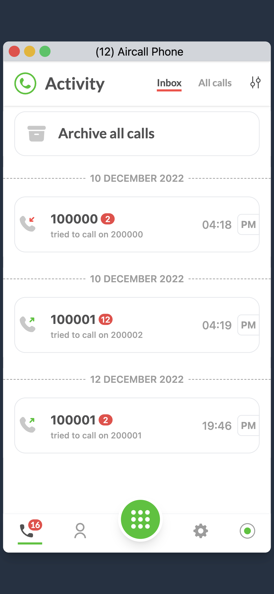

# Aircall 
A ReactJS application that utilises Tailwind to complete my submission for the Speer.io FrontEnd Hiring Assignment.

## Summary

This ReactJS app is a simple Activity Feed application designed to showcase my skills in ReactJS practices and code readability. 
The app includes features like:

- **Activity Feed**: A simple list of calls displaying relevant information.
- **Activity Detail**: Detailed information about a specific call.
- **Archive**: Users can archive or unarchive individual calls. Archived calls are moved to a separate Archived Tab.
- **Archive All Button**: Allows users to archive all calls in the Activity Feed.
- **Unarchive All Button**: Allows users to unarchive all calls in the Archived Tab.

## Getting Started
Check out the Vercel Link [Aircall](https://vasu1712uuid7bbc4cda.vercel.app/home)

1. Clone the repository to your local machine:

    ```bash
    git clone https://github.com/Vasu1712/7bbc4cda.git
    ```

2. Navigate to the project directory:

    ```bash
    cd 7bbc4cda
    ```

3. Install dependencies:

    ```bash
    npm install
    ```

4. Run the app:

    ```bash
    npm start
    ```

5. Open your browser and visit [http://localhost:3000](http://localhost:3000) to view the app.

## Submission Requirements
UUID number - *7bbc4cda*

Here's what the app looks like:





## API documentation

### Routes

Here is the base URL of the API: https://cerulean-marlin-wig.cyclic.app/ <br>
If you run into a CORS error, please prepend the base URL with this CORS Anywhere server URL: https://charming-bat-singlet.cyclic.app/ <br>
The prepended base URL will look like this https://charming-bat-singlet.cyclic.app/https://cerulean-marlin-wig.cyclic.app/

The API is hosted on a free server, which is why the first time you call the API it might throw an error. The server goes to sleep if there hasn't been any activity for a while, but after 30-60 seconds of making the first call, it should work as expected. Please reach out to us in case it doesn't.

- **GET** - BASE_URL/activities: get calls to display in the Activity Feed
- **GET** - BASE_URL/activities/<call_id> retrieve a specific call details
- **PATCH** - BASE_URL/activities/<call_id> update a call. The only field updatable is `is_archived (bool)`. You'll need to send a JSON in the request body:
```
{
  is_archived: true
}
```
- **PATCH** - BASE_URL/reset: Reset all calls to initial state (usefull if you archived all calls).

### Call object

- **id** - unique ID of call
- **created_at** - creation date
- **direction** - `inbound` or `outbound` call
- **from** - caller's number
- **to** - callee's number
- **via** - Aircall number used for the call
- **duration** - duration of a call (in seconds)
- **is_archived** - call is archived or not
- **call_type** - can be a `missed`, `answered` or `voicemail` call.


## Author

Vasu
Email: vasu.pal.ug20@nsut.ac.in
LinkedIn: [Vasu Pal](https://www.linkedin.com/in/vasu-pal-300448203/)
Portfolio: [Vasu](https://vasu1712.vercel.app/)

## License

This project is licensed under the MIT License - see the [LICENSE](LICENSE) file for details.
